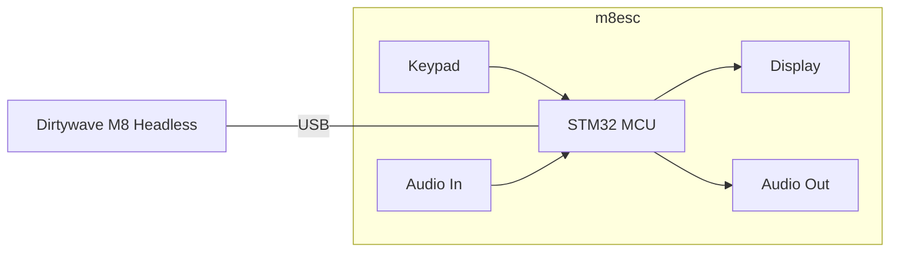

# m8ec

Embedded Client for the [Dirtywave M8](https://dirtywave.com/)
[Headless](https://github.com/Dirtywave/M8HeadlessFirmware). Power-efficient and cost-efficient desktop-free _head_.

# Goal

Complement the Dirtywave M8 headless (Teensy 4.1) with a display, keypad, and an audio interface that are similar to the original M8
hardware unit. The peripherals may be driven by a microcontroller acting as a client (USB host) to the Teensy 4.1 running M8
headless firmware. Have fun and learn something along the way.

# Requirements

-   Complementary hardware peripherals must be easily available and cheap.

# Plan (draft)

-   Start with the hardware you have on hand:

    -   Microcontroller: WeAct STM32F411CEU6 Black Pill.
    -   Display: 2.8" TFT LCD (ILI9341) module.Keypad: Modified USB mechanical key number pad as GPIO input. Probably...
    -   Audio out interface: PCM5102A module.Audio in the interface: PCM1802 module.

-   [ ] Hook up the display to the Black Pill.
-   [ ] Find a good library for the display. DMA-driven SPI - must, FreeRTOS compatible - must. Candidates:
    -   https://github.com/ardnew/ILI9341-STM32-HAL: DMA, FreeRTOS. **Probably try this one first as it looks easiest to
        get going on the Black Pill (STM32 HAL) and test the display.**
    -   https://github.com/martnak/STM32-ILI9341: no DMA, no OS support, but may be useful for reference.
    -   https://github.com/juj/fbcp-ili9341: made for Raspberry Pi, but may be useful.
    -   https://github.com/adafruit/Adafruit_ILI9341: looks mature, but Arduino - may require some work to port.
    -   https://github.com/PaulStoffregen/ILI9341_t3: Teensy 3.x, but may be useful for reference.
-   [ ] Get the display working with the Black Pill. Draw some stuff on it.
-   [ ] Figure out the USB client interface. Research what M8 Headless expects from the client.
    -   https://github.com/laamaa/m8c could be very useful although it's for Windows/Linux/MacOS.
-   [ ] Get the USB client working with the Black Pill.
-   [ ] Get the display working with the M8 headless via USB client.
-   [ ] Modify the keypad to be driven by the Black Pill GPIO.
-   [ ] Get The Keypad working with the Black Pill.
-   [ ] Get the keypad working with the M8 headless via USB client.
-   [ ] Hook up the audio-out interface to the Black Pill.
-   [ ] Get the audio out working with the Black Pill.
-   [ ] Get the audio out working with the M8 headless via USB client.
-   [ ] Hook up the audio in the interface to the Black Pill.
-   [ ] Get the audio in working with the Black Pill.
-   [ ] Try to get the audio working with the M8 headless via a USB client. From reading online, it's tricky.

# Looking Into Future

-   [ ] MIDI in/out? If supported by the M8 headless.
-   [ ] Eurorack System Integration? Maybe make a module out of it.

# Links

-   Original Dirtywave M8: https://dirtywave.com/products/m8-tracker
-   M8 Headless: https://github.com/Dirtywave/M8HeadlessFirmware
