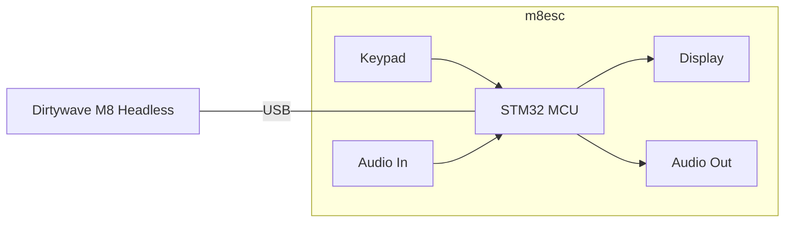

# About

m8ec - Embedded Client for the [Dirtywave M8](https://dirtywave.com/)
[Headless](https://github.com/Dirtywave/M8HeadlessFirmware). Power-efficient and cost-efficient desktop-free _head_.

# Goal

Complement the Dirtywave M8 headless (Teensy 4.1) with a display, keypad, and an audio interface that are similar to the original M8
hardware unit. The peripherals may be driven by a microcontroller acting as a "client" (USB host in fact) to the Teensy 4.1 running M8
headless firmware. Also the goal is to have fun and learn something along the way.

# Requirements

- Complementary hardware peripherals must be easily available and cheap.

# Plan (draft)



- Start with the hardware you have on hand:

  - Microcontroller: WeAct STM32F411CEU6 Black Pill.
  - Display: 2.8" TFT LCD (ILI9341) module.Keypad: Modified USB mechanical key number pad as GPIO input. Probably...
  - Audio out interface: PCM5102A module.Audio in the interface: PCM1802 module.

- [ ] Hook up the display to the Black Pill.
- [ ] Find a good library for the display. DMA-driven SPI - must, FreeRTOS compatible - must. Candidates:
  - <https://github.com/ardnew/ILI9341-STM32-HAL>: DMA, FreeRTOS. **Probably try this one first as it looks easiest to
        get going on the Black Pill (STM32 HAL) and test the display.**
  - <https://github.com/martnak/STM32-ILI9341>: no DMA, no OS support, but may be useful for reference.
  - <https://github.com/juj/fbcp-ili9341>: made for Raspberry Pi, but may be useful.
  - <https://github.com/adafruit/Adafruit_ILI9341>: looks mature, but Arduino - may require some work to port.
  - <https://github.com/PaulStoffregen/ILI9341_t3>: Teensy 3.x, but may be useful for reference.
- [ ] Get the display working with the Black Pill. Draw some stuff on it.
- [ ] Figure out the USB client interface. Research what M8 Headless expects from the client.
  - <https://github.com/laamaa/m8c> could be very useful although it's for Windows/Linux/MacOS.
- [ ] Get the USB client working with the Black Pill.
- [ ] Get the display working with the M8 headless via USB client.
- [ ] Modify the keypad to be driven by the Black Pill GPIO.
- [ ] Get The Keypad working with the Black Pill.
- [ ] Get the keypad working with the M8 headless via USB client.
- [ ] Hook up the audio-out interface to the Black Pill.
- [ ] Get the audio out working with the Black Pill.
- [ ] Get the audio out working with the M8 headless via USB client.
- [ ] Hook up the audio in the interface to the Black Pill.
- [ ] Get the audio in working with the Black Pill.
- [ ] Try to get the audio working with the M8 headless via a USB client. From reading online, it's tricky.

# Building Firmware From Source

The project was originally kickstarted in WSL Ubuntu.

## WSL or Linux Ubuntu

1. Install these prerequisites:

    ```bash
    sudo apt update && sudo apt upgrade -y
    sudo apt install -y git cmake python3
    ```

2. Install Arm GNU Toolchain:

    > for more details see [this](https://lindevs.com/install-arm-gnu-toolchain-on-ubuntu)  

    ```bash
    ARM_TOOLCHAIN_VERSION=$(curl -s https://developer.arm.com/downloads/-/arm-gnu-toolchain-downloads | grep -Po '<h4>Version \K.+(?=</h4>)')
    curl -Lo gcc-arm-none-eabi.tar.xz "https://developer.arm.com/-/media/Files/downloads/gnu/${ARM_TOOLCHAIN_VERSION}/binrel/arm-gnu-toolchain-${ARM_TOOLCHAIN_VERSION}-x86_64-arm-none-eabi.tar.xz"
    sudo mkdir /opt/gcc-arm-none-eabi
    sudo tar xf gcc-arm-none-eabi.tar.xz --strip-components=1 -C /opt/gcc-arm-none-eabi
    echo 'export PATH=$PATH:/opt/gcc-arm-none-eabi/bin' | sudo tee -a /etc/profile.d/gcc-arm-none-eabi.sh
    source /etc/profile
    arm-none-eabi-gcc --version
    arm-none-eabi-g++ --version
    arm-none-eabi-gdb --version
    rm -rf gcc-arm-none-eabi.tar.xz
    ```

    If getting `arm-none-eabi-gdb: error while loading shared libraries: libncursesw.so.5` error, install `libncurses5`:

    ```bash
    sudo apt install -y libncurses5
    ```

    If that does not help, try this:

    ```bash
    sudo apt install -y gdb-multiarch
    sudo mv /usr/bin/arm-none-eabi-gdb /usr/bin/arm-none-eabi-gdb.bak
    sudo ln -s /usr/bin/gdb-multiarch /usr/bin/arm-none-eabi-gdb
    ```

3. Clone the project and its submodules:

    ```bash
    git clone https://github.com/lukasnee/m8ec.git
    git checkout prototype
    git submodule update --init --recursive
    ```

4. Build using the project tool:

    ```bash
    python3 tools/m8ec.py -b
    ```

5. Build debug version:

    ```bash
    python3 tools/m8ec.py -bd
    ```

> `python3 tools/m8ec.py -h` for more options.

# Flashing the Built Firmware

## WSL or Linux Ubuntu

1. [WSL ONLY] [Install the USBIPD-Win project](https://learn.microsoft.com/en-us/windows/wsl/connect-usb#install-the-usbipd-win-project).

2. Install ST-Link tools.

    ```bash
    sudo apt-get install -y stlink-tools
    ```

3. Plug in ST-LINK/V2 SWD interface to the target MCU.
4. Plug in ST-LINK/V2 USB interface to your PC.

3. Flash using the project tool.

    WSL:

    ```bash
    sudo python3 tools/m8ec.py --wsl -f
    ```

    Linux Ubuntu:

    ```bash
    python3 tools/m8ec.py -f
    ```

# Debugging

## WSL or Linux Ubuntu

# Serial

1. Install `minicom`.

    ```bash
    sudo apt-get install -y minicom
    ```

2. Open a terminal using the project tool.

    ```bash
    sudo python3 tools/m8ec.py --serial
    ```

# OpenOCD + VS Code + Cortex-Debug

1. Install openOCD.

    ```bash
    sudo apt-get install -y openocd
    ```

2. Open the project in VS Code.

3. Install the `marus25.cortex-debug` extension in VS Code.
4. Build debug version of the firmware and flash it to the target MCU.

    WSL:

    ```bash
    python3 tools/m8ec.py --wsl -bdf
    ```

    Linux Ubuntu:

    ```bash
    python3 tools/m8ec.py -bdf
    ```

    > When flashing the debug version, the m8ec.py tool will finish by starting openOCD. You can stop it with `Ctrl+C`.

5. In VS Code, press `F5` or open the Debug tab and click the green arrow to start debugging.

# SEGGER SystemView + ST-Link as J-Link

## Windows [draft]

1. Build firmware with SEGGER SystemView enabled.

    ```bash
    python3 tools/m8ec.py --systemview -bf
    ```

2. Flash the firmware to the target MCU.

    ```bash
    python3 tools/m8ec.py -f
    ```

3. Install latest [SEGGER SystemView](https://www.segger.com/products/development-tools/systemview/) and J-Link drivers.
4. [STLinkReflash](https://www.segger.com/products/debug-probes/j-link/models/other-j-links/st-link-on-board/) tool can be used to reflash the ST-Link firmware to J-Link and back (ST-Link V2-1 only).

> In case [J-Link shown as generic BULK device in Windows](https://wiki.segger.com/J-Link_shown_as_generic_BULK_device_in_Windows).

5. Start SystemView and connect to the target MCU.

5. TBD...

# Looking Into Future

- [ ] MIDI in/out? If supported by the M8 headless.
- [ ] Eurorack System Integration? Maybe make a module out of it.

# Links

- Original Dirtywave M8: <https://dirtywave.com/products/m8-tracker>
- M8 Headless: <https://github.com/Dirtywave/M8HeadlessFirmware>
