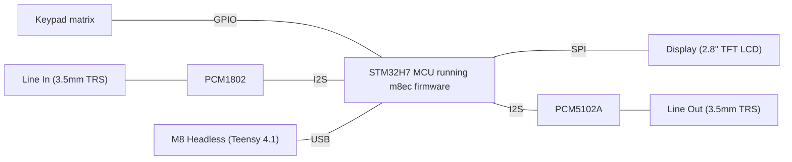

# m8ec

[Headless Dirtywave M8](https://github.com/Dirtywave/M8HeadlessFirmware)
embedded system client.

> [!Important] Not yet functional - work in progress.

## Overview

This project is comparable to [laamaa/m8c](https://github.com/laamaa/m8c) except
that it is based on an STM32 microcontroller running RTOS instead of
microprocessor system that would be running standard OS like Linux, Windows or
MacOS. Implementation on microcontroller enables creating a compact and
power-efficient client system where the Teensy board, USB connection, display,
keyboard and the audio interfaces could be fully integrated on a single board:

```mermaid
graph LR
D[Keypad matrix] ----|GPIO| B
H[PCM1802] ---|I2S| B
G --- I["Line Out (3.5mm TRS)"]
J["Line In (3.5mm TRS)"] --- H
B ----|SPI| C["Display (2.8'' TFT LCD)"]
B ---|I2S| G[PCM5102A]
A["M8 Headless (Teensy 4.1)"] ---|USB| B[STM32H7 MCU running m8ec firmware]
```

You could create custom hardware solutions where M8 headless would be
integrated in an eurorack system in some interesting way...

Some pictures of my prototype hardware:

| Left Side View | Front View | Right Side View |
:-------------------------:|:-------------------------:|:-------------------------:
||

### What Works

- Video feed to the display.
- Keypad input.

### What's Planned

- Audio input/output.
- MIDI input/output.
- PCB design with BOM list.

## Motivation

Some time around the spring of 2023, I discovered the M8 tracker on YouTube and
immediately wanted to get one. As an embedded systems engineer, I was deeply
impressed and inspired by what Timothy of Trash80 managed to create on the
Teensy platform - huge respect for the guy!

Anyway, reasons like the cost, limited product availability, potentially high shipping
costs to my country gave me doubts if I really need to buy the thing 🫠. These doubts lead me to experiment with the M8 headless firmware and
the [laamaa/m8c](https://github.com/laamaa/m8c) client software made to
work with it. I got curious how m8c interfaces with the M8 headless firmware. Since it is open source, I took a look at the code. I soon
realized that making M8 headless client on a microcontroller is feasible,
and I already have all the hardware parts lying around for a prototype. This seemed
like a fun challenge, a great project to learn something new and also,
potentially, a fulfilling result - portable M8 headless experience 😋.

Having said that, I understand that this project could potential harm Dirtywave company. If it raises any concerns, I am happy to talk with M8 creator(s) about the course of my project. I have no
intention to compete or profit from this project and I want to be responsible and
respectful to the [original M8 hardware
product](https://dirtywave.com/products/m8-tracker-model-02).

## Current Status

I must admit, I really underestimated how difficult the USB part is going to be -
it is not common to have a USB **host** on an embedded system especially with
composite interface support for audio, CDC and MIDI.

First I tried the obvious, STM32's USB host library. It turns out it is quite
limited and it basically has no proper documentation. I ended up modifying the
library, for example, to support composite mode, and, later realized it's not
worth the effort... Moreover, ST's state machine based USB stack implementation is quite
inefficient so better use some more mature USB stack. 

Moving on, there
is this popular USB stack for embedded called TinyUSB, but it lacks the features
needed to achieve full M8 headless functionality. So skipping that... 

Next, I tried CherryUSB library and had some better luck with it. However, it
lacks documentation and examples on how to implement audio class host
applications. 

So now I have kinda lost hope. So many hours spent on this thing...

There is maybe one more chance to get it all working - ThreadX's USBX stack
which was made open source. There are these two guides on how to use it with
STM32H7
([this](https://community.st.com/t5/stm32-mcus/how-to-implement-the-usb-device-composite-class-in-stm32-using/ta-p/645017)
and
[this](https://community.st.com/t5/stm32-mcus/how-to-implement-usbx-in-standalone-mode/ta-p/614435)).
I guess I'm going to try that next if I will ever recover from the frustration of the previous attempts...

## Documentation

- [Development Notes](docs/DEVELOPMENT.md)
- [To Do List](docs/TODO.md)
