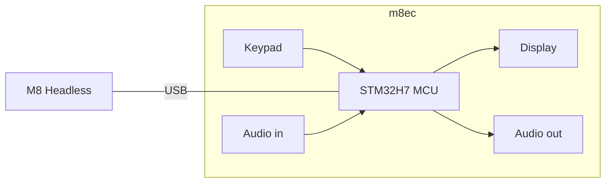

# m8ec

[Headless Dirtywave M8](https://github.com/Dirtywave/M8HeadlessFirmware)
embedded system client.

> [!Important] Not yet functional - work in progress.

## Overview

This project is comparable to [laamaa/m8c](https://github.com/laamaa/m8c) except
that it is based on an STM32 microcontroller running RTOS instead of
microprocessor system that would be running standard OS like Linux, Windows or
MacOS. Implementation on microcontroller enables creating a compact and
power-efficient client system where the Teensy board, USB connection, display,
keyboard and the audio interfaces would be fully integrated on a single board.

Some pictures of my prototype hardware:

| Left Side View | Front View | Right Side View |
:-------------------------:|:-------------------------:|:-------------------------:
||

```mermaid
graph LR
    D[Keypad] --> B
    A[M8 Headless] -----|USB| B[STM32H7 MCU]
    B --> C[Display]
    B --> E[Audio out]
    F[Audio in] --> B
    subgraph m8ec
        B
        C
        D
        E
        F
    end
```

### What Works

- Video feed to the display.
- Keypad input.

### What's Planned

- Audio input/output.
- MIDI input/output.
- PCB design with BOM list.

## Motivation

Some time around the spring of 2023, I discovered the M8 tracker on YouTube and
immediately wanted to get one. As an embedded systems engineer, I was deeply
impressed and inspired by what Timothy of Trash80 managed to create on the
Teensy platform - huge respect for him!

Anyway, the lack of M8 product availability, potentially high shipping costs to
my country and my financial situation gave me doubts if I really need the thing
🫠. These doubts lead me to experiment with the M8 headless firmware and the
[laamaa/m8c](https://github.com/laamaa/m8c) M8 client, an open source project. I
explored the source code, and I soon realized that making M8 headless client on
a microcontroller could be feasible even though the idea of composite USB
**host** on an embedded system is daunting... Anyway, this seemed like a fun
challenge, a great project for learning something new and potentially a very
exciting result personally 😋. I also have ideas of custom hardware solutions
where M8 could be integration in a Eurorack system in some interesting way.

Having said that, I understand that this project has the potential to do more
harm than good to the Dirtywave and its creator(s). I'd be more than happy to
discuss this project and its course with the creator(s) if it raises any
concerns. I have no intention to compete or profit from this project. I want to
be responsible and respectful to the [original M8 hardware product](https://dirtywave.com/products/m8-tracker-model-02).

## Documentation

- [Development Notes](docs/DEVELOPMENT.md)
- [To Do List](docs/TODO.md)