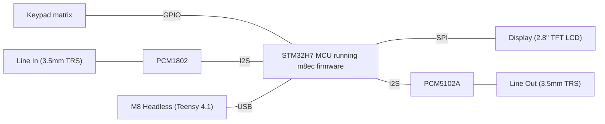

# m8ec

[Headless Dirtywave M8](https://github.com/Dirtywave/M8HeadlessFirmware)
client on STM32 microcontroller.

> [!Important] The project is not really functional yet. A work in progress.

## Overview

m8ec is comparable to [laamaa/m8c](https://github.com/laamaa/m8c) except that it
runs on an embedded RTOS instead of a standard general-purpose OS like Linux.
Client implementation on a microcontroller has the potential of making the
solution compact and power-efficient where the Teensy board with M8 firmware,
host to client USB connection, display, keyboard and the audio interfaces are
fully integrated in a single hardware unit. This also means, that the
form-factor is completely customizable. Some ideas may include:

- Bigger display.
- M8 eurorack module.
- Custom portable M8 with a eurorack docking module.

```mermaid
graph LR
D[Keypad matrix] ----|GPIO| B
H[PCM1802] ---|I2S| B
G --- I["Line Out (3.5mm TRS)"]
J["Line In (3.5mm TRS)"] --- H
B ----|SPI| C["Display (2.8'' TFT LCD)"]
B ---|I2S| G[PCM5102A]
A["M8 Headless (Teensy 4.1)"] ---|USB| B[STM32H7 MCU running m8ec firmware]
```

## Project Status

### What Works

- Video feed to the display.
- Keypad input.

### What's Planned

- Audio input/output.
- MIDI input/output.
- PCB design with BOM list.

Some pictures of my prototype hardware:

||
-|-|-

### Current Challenges

I absolutely need to share my frustration with this project - that is for my own
good 😅... I really underestimated how difficult the USB part is going to be. It
is not common to have a USB **host** on an embedded system, especially working in
a **composite** mode with multiple audio, CDC and MIDI interfaces.

My journey for finding the right composite USB host solution started with
STM32's USB library. It took me quite a while to realize that it is simply the
wrong stack for this project. It does not support composite mode, has poor
documentation and, IMO, poor state machine architecture. I had some success
 modifying the library to get composite mode somewhat working, but later decided
it is not worth to push it further. I need some more mature USB stack. Then, I
tried out TinyUSB, but it also lacks the features needed to achieve full M8
headless functionality. Next, I tried CherryUSB library and had some better luck
with it. However, it lacks documentation and examples on how to implement audio
class host applications. The next best option I found was ThreadX's USBX stack
which was made open source not so long ago. There are these two guides on how to
use it with STM32H7
([this](https://community.st.com/t5/stm32-mcus/how-to-implement-the-usb-device-composite-class-in-stm32-using/ta-p/645017)
and
[this](https://community.st.com/t5/stm32-mcus/how-to-implement-usbx-in-standalone-mode/ta-p/614435)).
I guess I will try USBX once I recover from hours and hours of frustration and
disappointment... 😅

## Motivation

Some time around the spring of 2023, I discovered the M8 tracker on YouTube and
immediately wanted to get one. As an embedded systems engineer, I was deeply
impressed and inspired by what Timothy of Trash80 managed to create on the
Teensy platform - huge respect for the guy! I was considering buying the M8 for
a while, but reasons like limited stock, potentially high shipping costs to my
country and my financial situation gave me doubts if I really need one 🫠. These
doubts lead me to experiment with the M8 headless firmware and the
[laamaa/m8c](https://github.com/laamaa/m8c) client software that is made to work
with it. m8c is an open source project which got me curious how it interfaces
with the M8 headless firmware, so I took a look at the code. I then realized
that making M8 headless client on a microcontroller is likely feasible, and I
already had basically all the hardware parts lying around. This seemed like a
fun challenge and a great project to learn something new.

Having said that, I understand that this project has the potential to do more
harm than good to the Dirtywave and its creator(s). I'd be happy to discuss this
project and its course with the creator(s) if it raises any concerns. I have no
intention to compete or profit from this project and I want to be responsible
and respectful to the [original M8 hardware
product](https://dirtywave.com/products/m8-tracker-model-02).

## Documentation

- [Development Notes](docs/DEVELOPMENT.md)
- [To Do List](docs/TODO.md)
