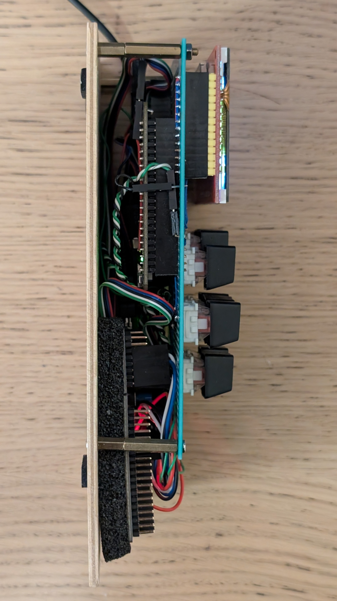
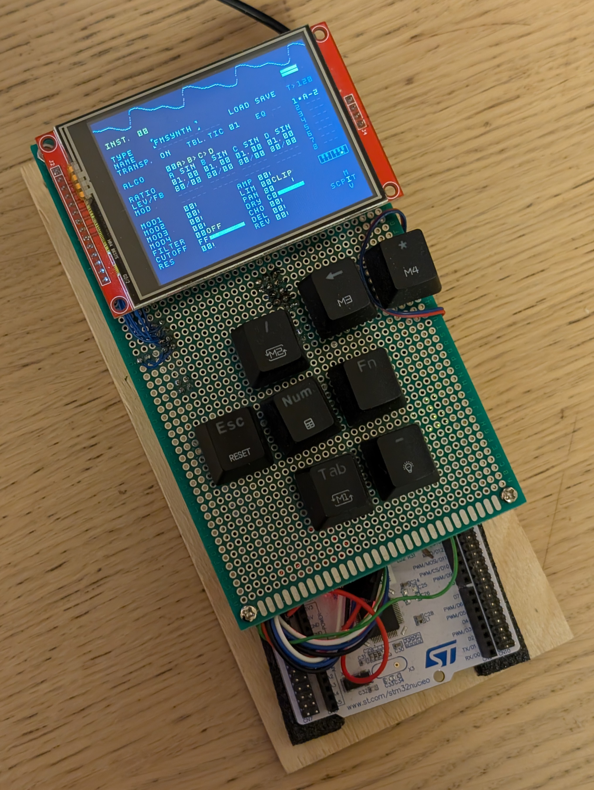
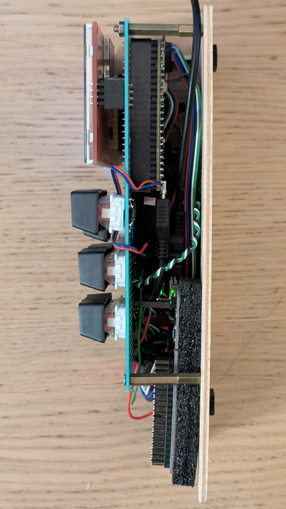

# Development Notes

Some notes on the development of the m8ec project.

## Prototype Hardware

- MCU dev board:
  [lukasnee/W25Q64_STM32H750VB-DevEBox](https://github.com/lukasnee/W25Q64_STM32H750VB-DevEBox.git)
- Display: 2.8" TFT LCD (ILI9341) module via SPI interface.
- Keypad: hand-built mechanical key matrix driven directly via MCU GPIO pins.
- Audio out: PCM5102A module (not yet implemented).
- Audio in: PCM1802 module (not yet implemented).
- Development instrumentation: STM32 Nucleo board for ST-Link SWD + integrated
  serial interface.

| Left Side View | Front View | Right Side View |
:-------------------------:|:-------------------------:|:-------------------------:
||

## Development Environment Setup

> [!Note] This project was originally and is primarily developed in WSL Ubuntu.

1. Install these prerequisites:

    ```bash
    sudo apt update && sudo apt upgrade -y
    sudo apt install -y git ninja-build python3
    ```

    `sudo apt install -y cmake` may install older version of CMake than 4.0.0.
    Instead you may want to install latest CMake from
    [here](https://cmake.org/download/). For example:

    ```bash
    VERSION=$(curl -s https://api.github.com/repos/Kitware/CMake/releases/latest | grep -Po '"tag_name": "v\K[^"]*')
    cd /tmp/
    wget https://github.com/Kitware/CMake/releases/download/v$VERSION/cmake-$VERSION-linux-x86_64.sh
    sudo sh cmake-$VERSION-linux-x86_64.sh --skip-license --prefix=/usr/local/
    ```

2. Install Arm GNU Toolchain:

    ```bash
    VERSION=$(curl -s https://developer.arm.com/downloads/-/arm-gnu-toolchain-downloads | grep -Po '<h4>Version \K.+(?=</h4>)')
    curl -Lo gcc-arm-none-eabi.tar.xz "https://developer.arm.com/-/media/Files/downloads/gnu/${VERSION}/binrel/arm-gnu-toolchain-${VERSION}-x86_64-arm-none-eabi.tar.xz"
    sudo mkdir /opt/gcc-arm-none-eabi
    sudo tar xf gcc-arm-none-eabi.tar.xz --strip-components=1 -C /opt/gcc-arm-none-eabi
    echo 'export PATH=$PATH:/opt/gcc-arm-none-eabi/bin' | sudo tee -a /etc/profile.d/gcc-arm-none-eabi.sh
    source /etc/profile
    arm-none-eabi-gcc --version
    arm-none-eabi-g++ --version
    arm-none-eabi-gdb --version
    rm -rf gcc-arm-none-eabi.tar.xz
    ```

    If getting `arm-none-eabi-gdb: error while loading shared libraries:
    libncursesw.so.5` error, install `libncurses5`:

    ```bash
    sudo apt install -y libncurses5
    ```

    If that does not help, try this:

    ```bash
    sudo apt install -y gdb-multiarch
    sudo mv /usr/bin/arm-none-eabi-gdb /usr/bin/arm-none-eabi-gdb.bak
    sudo ln -s /usr/bin/gdb-multiarch /usr/bin/arm-none-eabi-gdb
    ```

### Install J-Link Software and Documentation Pack

1. Go to [SEGGER J-Link Software and Documentation Pack](https://www.segger.com/downloads/jlink/#J-LinkSoftwareAndDocumentationPack)

2. Download `64-bit DEB Installer`.

3. Install the downloaded package:

    ```bash
    sudo dpkg -i JLink_Linux_V<XXX>_x86_64.deb
    echo 'export PATH=/opt/SEGGER/JLink:$PATH' >> ~/.bashrc
    source ~/.bashrc
    ```

## Building and Flashing the Firmware

The application firmware (m8ec) is based on project
[lukasnee/W25Q64_STM32H750VB-DevEBox](https://github.com/lukasnee/W25Q64_STM32H750VB-DevEBox.git).
It has a [`bl_iram`](../extern/W25Q64_STM32H750VB-DevEBox/docs/bl_iram.md)
bootloader firmware that enables running application firmware from MCU's
internal RAM. The application firmware is loaded into the volatile RAM from a
file every time the MCU boots. The file is stored in a file system that is
mounted on the external flash memory (W25Q64). Application firmware file can be
uploaded from your PC via serial interface using a client command tool
[`tools/m8ec.py`](../tools/m8ec.py).

First, clone the project and its submodules:

    ```bash
    git clone https://github.com/lukasnee/m8ec.git
    git submodule update --init --recursive
    ```

Build and flash the `bl_iram` bootloader by following instructions
[here](../extern/W25Q64_STM32H750VB-DevEBox/docs/bl_iram.md).


```bash
cmake --workflow STM32H750-rel # release build
cmake --workflow STM32H750-dbg # debug build
```

then upload the application firmware to the MCU:

```bash
python3 tools/m8ec.py -f
```

> [!Note]
>
> If using WSL, make sure to attach the ST-Link USB interface. There is a very
> convenient VSCode extension to make it easier: `thecreativedodo.usbip-connect`.

## Debugging

### Serial (printf)

1. Install `minicom`.

    ```bash
    sudo apt-get install -y minicom
    ```

2. Open a terminal using the project tool.

    ```bash
    python3 tools/m8ec.py --serial
    ```

### SEGGER SystemView + ST-Link as J-Link

> Here we use SystemView GUI for Windows, but it supports other OSes as well.

1. Build firmware with SEGGER SystemView enabled.

    ```bash
    cmake --workflow STM32H750-sysview
    ```

2. Flash the firmware to the target MCU.

    ```bash
    python3 tools/m8ec.py -f
    ```

3. Install latest [SEGGER
   SystemView](https://www.segger.com/products/development-tools/systemview/)
   and J-Link drivers.
4. [STLinkReflash](https://www.segger.com/products/debug-probes/j-link/models/other-j-links/st-link-on-board/)
   tool can be used to reflash the ST-Link firmware to J-Link and back (ST-Link
   V2-1 only).

> In case [J-Link shown as generic BULK device in
> Windows](https://wiki.segger.com/J-Link_shown_as_generic_BULK_device_in_Windows).

5. Start SystemView and connect to the target MCU.

6. TBD...

#### TODO

- Looks like the ucprof trims a lot of recording from start and end. Figure out what's up.
